# Recipe Application

Recipe application is a mobile application developed using React Native that allows users to create, view, update, and delete their own recipes. Users can also view other recipes from the website and watch cooking lessons by simply clicking on the link to YouTube.

The application includes features such as login and register screens, a home screen, recipe search by categories, detailed recipe views, a feedback screen, and a calories screen to help calculate calories based on activities and weight.

## Key Features

### 🔑 Login and Register User Account
- Users can navigate to the login and register screens and perform the login and registration functions.

### 🔍 Search Recipe
- Users can search for recipes by entering keywords in the search bar. The app will fetch and display matching recipes based on the user’s input.

### 📂 Browse Recipe by Categories
- Users can find recipes by browsing through different food categories.

### 🍽️ Get Recipe of the Day
- Users can get a random recipe of the day by tapping the “Get Recipe of the Day” button.

### 📄 View Recipe
- Users can view the selected recipe on the Home Screen.

### 📝 Submit Feedback
- Users can submit feedback using a form with fields for their name, email address, the type of feedback, and remarks.

### 🍲 Display Own Recipes
- Users can view their own recipes stored in the SQLite database.

### ❌ Delete Recipes
- Users can delete recipes by pressing a "Delete" button. The app will first ask for confirmation before deleting the recipe from the database.

### ➕ Create Recipe
- Users can input and create a new recipe with a unique recipe ID, name, and description. The system will insert the new recipe into the database and update the instance variable of the OwnRecipeScreen.

### ✏️ Update Recipe
- Users can update the details of a recipe, including its name and description. The app will validate the input fields before allowing an update. The database operation will update the recipe where the recipeName, recipeDescription, and recipeID match the user's input.

### 👤 Display Profile
- Users can view their profile information, including their email.

## Getting Started

### Prerequisites

- Node.js
- npm (Node Package Manager)
- React Native CLI
- Android Studio or Xcode (for iOS)

### Installation

1. **Set up the React Native environment:**
   Follow the official [React Native environment setup guide](https://reactnative.dev/docs/environment-setup) for your operating system.

2. **Create a new React Native project:**

    ```bash
    npx react-native init RecipeApplication
    cd RecipeApplication
    ```

3. **Install dependencies:**

    ```bash
    npm install
    ```

4. **Add the provided screen code to your project:**
   - Replace the content in the `App.js` file with the provided screen code.
   - Create necessary component files in the appropriate directories if needed.

5. **Start the React Native project:**

    For iOS:
    ```bash
    npx react-native run-ios
    ```

    For Android:
    ```bash
    npx react-native run-android
    ```
    
## Screenshots

### 🔑 Login Screen
<p align="center">
  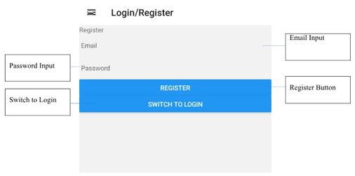
</p>

### 🏠 Home Screen
<p align="center">
  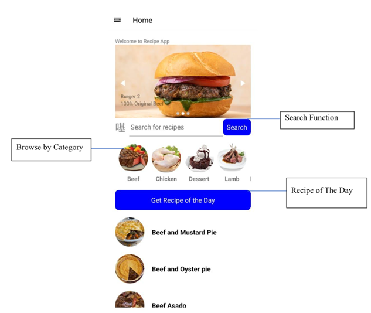
</p>

### 🎉 Welcome Screen
<p align="center">
  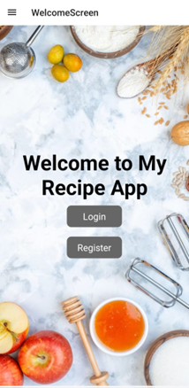
</p>

### 📋 View Recipe
<p align="center">
  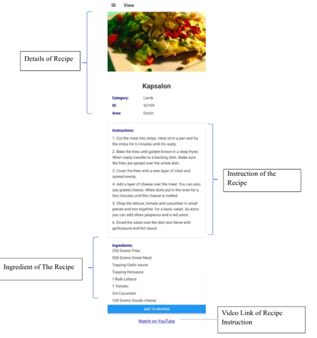
  
</p>

### 🍲 Recipe Details and Actions
<p align="center">
  <p align="center">
  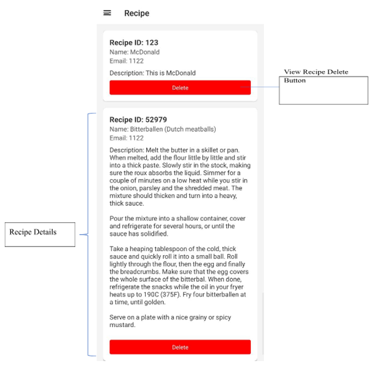
  </p>
  <p align="center">
  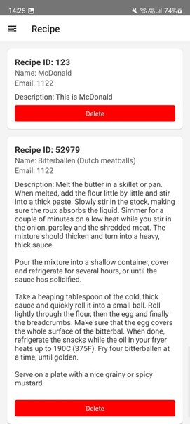
    </p>
</p>

### 📂 Own Recipes
<p align="center">
  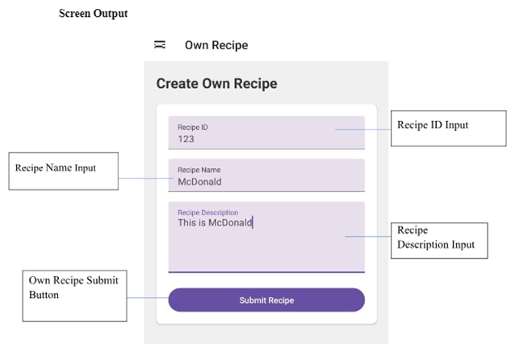
</p>

### ✏️ Update Recipe
<p align="center">
  <p align="center">
  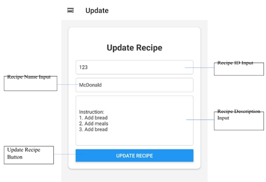
  </p>
  <p align="center">
  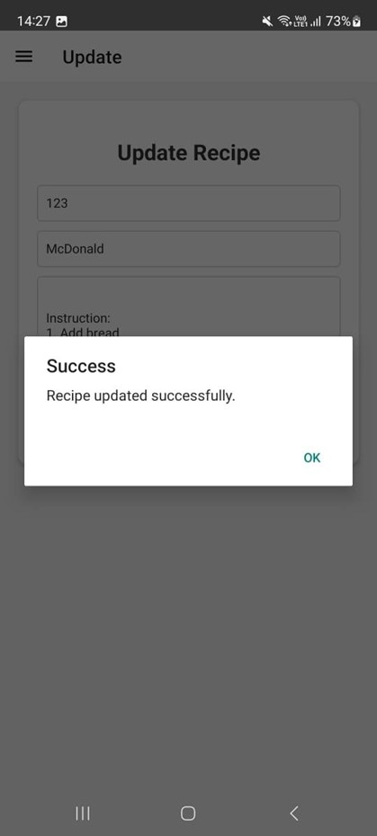
    </p>
     <p align="center">
  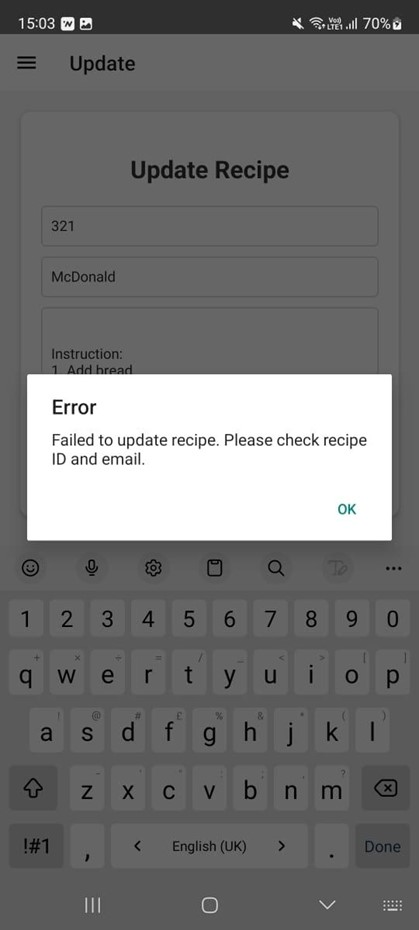
       </p>
</p>

### 👤 Profile Screen
<p align="center">
  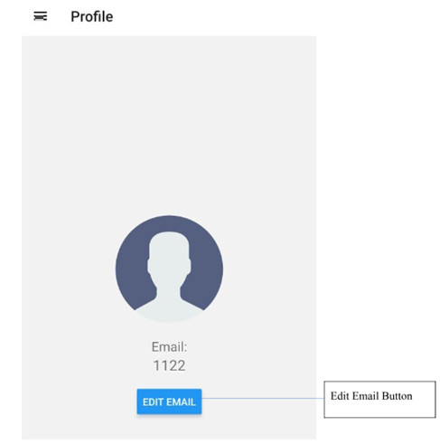
</p>

